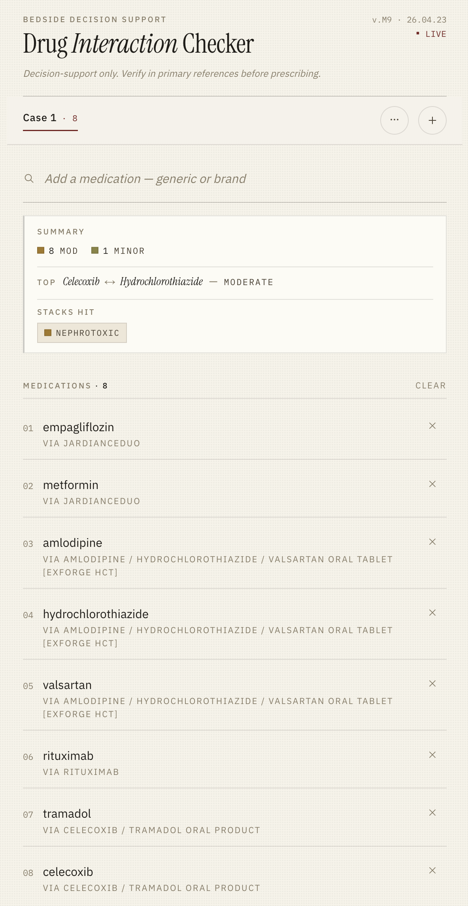
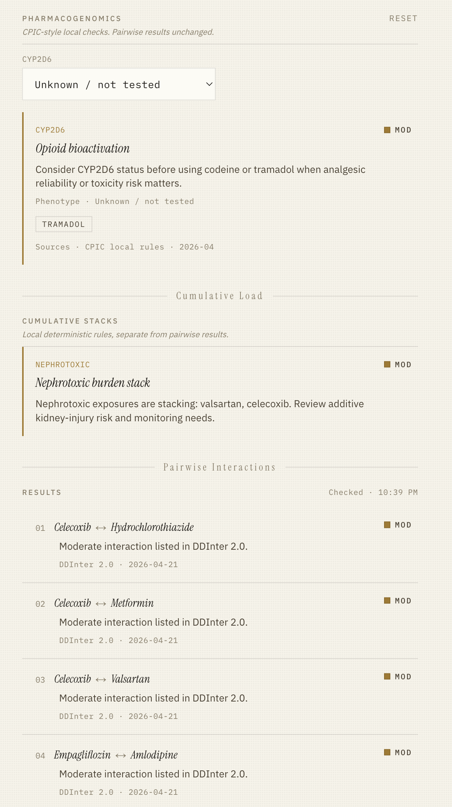

# Drug Interaction Checker

A bedside-first web app for fast medication-list review.

**Decision-support only. Verify in primary references before prescribing.**

## What it does

Drug Interaction Checker helps clinicians paste or type a medication list and quickly see:

- significant pairwise drug interactions
- cumulative risk stacks such as bleeding, hyperkalemia, or bradycardia
- pharmacogenomic warnings
- patient-phenotype modifiers such as renal or hepatic risk
- copyable prompts for asking an LLM chat to explain mechanisms
- local metabolism / transporter annotations under matched drug names

The core checker is deterministic and local-first. No AI is involved in matching, scoring, or warning generation.

## Features

### Intelligent Input

- **Fuzzy single match:** standard search behavior for one drug at a time, tuned for accurate matching.
- **Batch match:** fast matching for many drugs in one input.
- Type multiple drugs in a single line.
- Copy and paste a chunk of text that contains a medication list.
- Remove existing drugs easily.
- Accepts both generic names and commercial names, primarily using US formulation conventions.
- Accepts combination pills and expands them into all matched ingredients.
- In batch and paste mode, each matched term is resolved to ingredient-level generic names before being added.
- Automatically rejects ingredients already present in the case when adding new input.
- Combination pills in batch and paste mode pause for confirmation instead of silently adding the wrong thing.
- Matched drug chips can show curated CYP, non-CYP metabolism, transporter, and P-gp annotations under the generic name (coverage: ~400+ drugs).
- Works almost entirely with keyboard-only use.

### Alias Dictionary

- Supports a local custom alias dictionary.
- Manual alias creation is useful for local shorthand, commercial products, and combination pills.
- JSON export and import are the only backup / transfer methods.
- This is manual work, but it is reliable and works well for combined products.

### Summary Box

- Shows the number of significant interactions.
- Shows major and moderate interaction counts.
- Shows the top drug interaction at a glance.
- Shows which cumulative stacks were triggered.

### Cumulative Stacks

Cumulative stacks are a core value of the app. They show additive risk across the whole medication list, not just one pairwise interaction.

Examples include:

- bleeding
- hyperkalemia
- hypokalemia
- hypercalcemia
- hypocalcemia
- hyponatremia
- hypernatremia
- hyperglycemia
- hyperuricemia
- myocardial depression
- fluid retention
- high anion gap metabolic acidosis
- serotonin syndrome
- nephrotoxicity
- normal gap acidosis
- bradycardia

The goal is to show potential side-effect burden up front, such as hyperkalemia risk when several matched drugs contribute to the same stack. Stack cards include copyable prompts so users can ask an LLM chat for mechanistic explanation.

### Pairwise Drug Interactions

- Checks each drug pair for interaction.
- Shows that an interaction exists and gives warning level at a glance.
- Does not try to replace a primary reference or full mechanistic monograph.
- Includes copyable prompts for asking an LLM chat to explain the mechanism.
- Warning strength can be modified by patient phenotype, such as renal or hepatic risk.
- Matching is fast because it relies on local rules and predetermined indexes.
- Once input is matched, interaction results update in real time.

### Pharmacogenomics

- Integrates pharmacogenomic warnings into the same workflow.
- Flags gene checks when a trigger drug is present.
- Keeps pharmacogenomic warnings separate from pairwise interaction results.
- PGx warning cards now expose copyable prompts asking why a gene should be tested for the matched drug and how to interpret the result.

Current examples include:

- CYP2C9 and VKORC1 for warfarin
- HLA-B*58:01 for allopurinol
- HLA-B*15:02 for carbamazepine
- HLA-B*57:01 for abacavir

### Design And Workflow

- Modern custom UI, not a vanilla Tailwind layout.
- Designed with a strong visual direction and the frontend-skill workflow.
- Works as a web app.
- Best on desktop when copying a medication list from an inpatient record and reviewing the result immediately.
- Also works on iPhone.
- Free to use.
- No AI is required for the core checker.

## Screenshots

### Main Interaction View



### Pharmacogenomics, Cumulative Load, And Pairwise Results



## How It Works

- Local deterministic interaction rules and precomputed indexes drive the core checker.
- RxNorm-based normalization supports generic matching.
- Curated brand and alias dictionaries support commercial names and combination products.
- Cumulative stack rules run locally.
- Pharmacogenomic rules run locally.
- Optional prompt-copy helpers make it easy to ask an external LLM chat for mechanism-level learning.


## Tech Stack

- Next.js 16
- React 19
- TypeScript
- Tailwind CSS v4
- Zustand + IndexedDB for local-first persistence
- RxNorm-based normalization
- DDInter-derived pairwise interaction layer
- Local deterministic cumulative-stack rules
- Local deterministic pharmacogenomics rules

## Getting Started

```bash
npm install
npm run build:data
npm run dev
```

Open `http://localhost:3000`.

## Clinical Note

This app is decision support only. It is built to surface signal quickly, not to replace clinical judgment, primary references, local policy, or prescribing responsibility.
